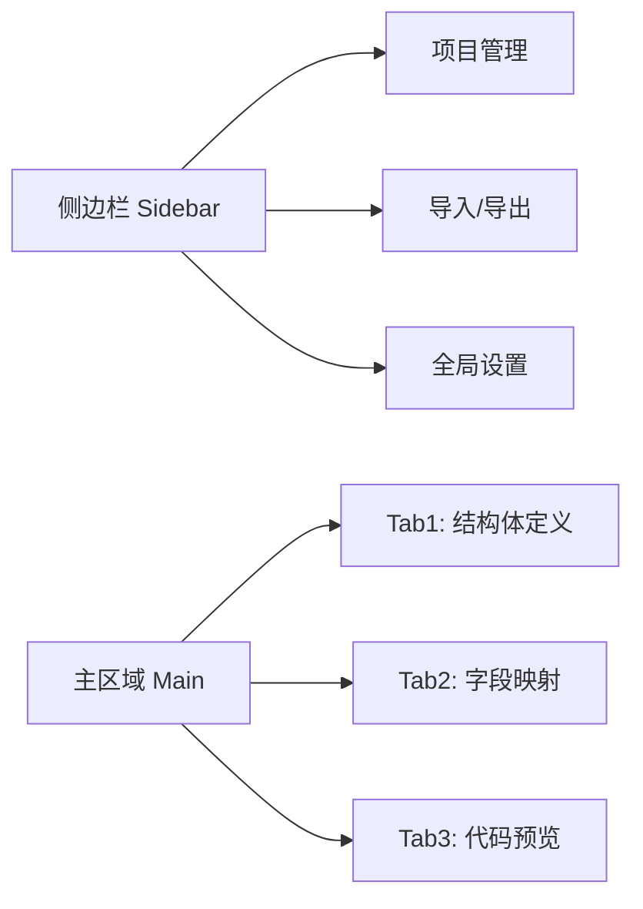
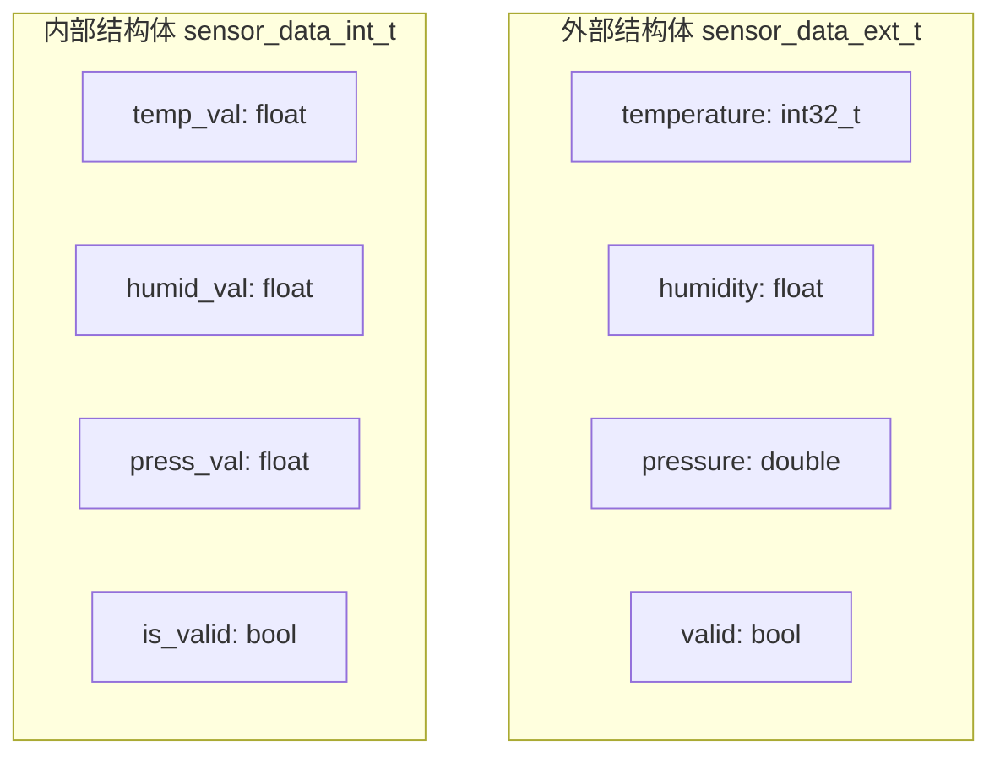
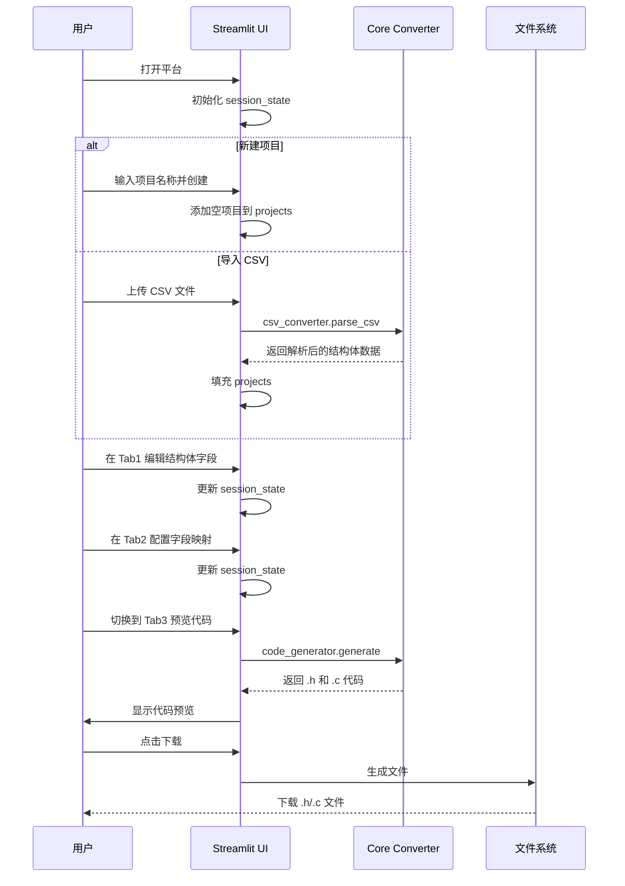

# Struct Converter Toolkit - 低代码平台实施计划

## 1. 项目概述

将现有的命令行 Struct Converter Toolkit 转化为基于 **Streamlit** 的可视化低代码平台，用户通过图形界面完成：
- 结构体字段的可视化定义与编辑
- 外部/内部结构体字段映射配置
- 转换规则与验证逻辑设置
- C 代码实时预览与下载
- CSV/Excel 文件导入与配置导出

## 2. 技术栈

| 组件 | 技术 | 说明 |
|------|------|------|
| 前端框架 | Streamlit | Python Web 框架，快速构建数据应用 |
| 数据处理 | pandas + openpyxl | Excel 文件读取支持 |
| CSV 处理 | Python 内置 csv 模块 | 兼容 Windows 7 |
| 代码高亮 | streamlit-ace 或纯 markdown | 代码预览 |
| 状态管理 | st.session_state | 会话状态持久化 |

## 3. 目标目录结构

```
struct_converter_toolkit/
├── app.py                          # Streamlit 主应用入口
├── core/
│   ├── __init__.py
│   ├── converter_base.py           # 重构后的核心转换逻辑基类
│   ├── csv_converter.py            # CSV 解析转换器
│   ├── excel_converter.py          # Excel 解析转换器
│   └── code_generator.py           # C 代码生成器（统一）
├── ui/
│   ├── __init__.py
│   ├── sidebar.py                  # 侧边栏：项目管理
│   ├── struct_editor.py            # 结构体定义可视化编辑器
│   ├── mapping_editor.py           # 字段映射与转换规则编辑器
│   └── code_preview.py             # 代码预览与下载
├── win7_struct_converter.py        # 保留原始命令行版本
├── enhanced_struct_converter.py    # 保留原始命令行版本
├── csv_structs/                    # CSV 输入目录
├── requirements.txt                # 更新后的依赖文件
├── run_platform.bat                # 一键启动脚本
└── plans/                          # 计划文档
```

## 4. 页面布局设计

### 4.1 整体布局



### 4.2 侧边栏 - 项目管理

- **新建项目**：输入结构体对名称，创建新的 external/internal 结构体对
- **项目列表**：显示已创建的结构体对，支持切换和删除
- **导入配置**：
  - 从 CSV 文件导入（兼容现有格式）
  - 从 Excel 文件导入
  - 从 JSON 配置文件导入
- **导出配置**：导出为 JSON 文件，方便保存和分享
- **全局设置**：
  - 输出头文件名称
  - 输出源文件名称
  - 头文件保护宏名称

### 4.3 Tab1 - 结构体定义编辑器

分为两个区域：**外部结构体** 和 **内部结构体**

每个区域包含：
- 字段列表表格（可编辑）
- 每行字段属性：
  - 字段名称 - text input
  - 字段类型 - selectbox，预定义 C 类型列表
  - 数组大小 - text input，可选
  - 位域宽度 - number input，可选
  - 嵌套结构体定义 - text input，可选
  - 验证字段 - text input，可选
- 添加字段 / 删除字段 按钮



### 4.4 Tab2 - 字段映射编辑器

- 映射关系列表，每行包含：
  - 外部字段 - selectbox，从外部结构体字段中选择
  - 内部字段 - selectbox，从内部结构体字段中选择
  - 转换规则 - text input，默认 =，可输入自定义函数名
  - 验证逻辑 - text input，可选，如 external->valid && recv_status
- 添加映射 / 删除映射 按钮
- 映射关系可视化示意图

### 4.5 Tab3 - 代码预览与下载

- **头文件预览**：带语法高亮的 .h 文件内容
- **源文件预览**：带语法高亮的 .c 文件内容
- **下载按钮**：
  - 下载 .h 文件
  - 下载 .c 文件
  - 打包下载两个文件

## 5. 核心数据模型

```python
# session_state 中的数据结构
session_state = {
    # 项目列表
    projects: {
        sensor_data: {
            external_struct_name: sensor_data_ext,
            internal_struct_name: sensor_data_int,
            external_fields: [
                {
                    name: temperature,
                    type: int32_t,
                    is_array: False,
                    array_size: ,
                    is_bitfield: False,
                    bitfield_width: None,
                    nested_struct_def: ,
                    validation_field: 
                },
                ...
            ],
            internal_fields: [
                {
                    name: temp_val,
                    type: float,
                    ...
                },
                ...
            ],
            mappings: [
                {
                    external_field: temperature,
                    internal_field: temp_val,
                    conversion_rule: =,
                    validation_logic: external->valid && recv_status
                },
                ...
            ]
        },
        ...
    },
    current_project: sensor_data,
    # 全局设置
    settings: {
        output_header: generated_structs.h,
        output_source: generated_structs.c,
        header_guard: GENERATED_STRUCTS_H
    }
}
```

## 6. 核心模块重构策略

### 6.1 converter_base.py - 基类

从 `Win7StructConverterGenerator` 和 `EnhancedStructConverterGenerator` 中提取公共逻辑：

- `struct_pairs` / `all_structs` 数据结构管理
- `generate_header_code()` - 头文件生成
- `generate_source_code()` - 源文件生成
- `_has_validation_field()` - 验证字段检测
- `_find_validity_field()` - 有效性字段查找

### 6.2 csv_converter.py - CSV 解析

继承基类，保留 `parse_csv()` 和 `_csv_to_dict_list()` 方法。

### 6.3 excel_converter.py - Excel 解析

继承基类，保留 `parse_excel()` 方法。

### 6.4 code_generator.py - 统一代码生成

将代码生成逻辑独立出来，接收标准化的数据模型，生成 C 代码。这样 UI 层只需调用：

```python
generator = CodeGenerator()
generator.load_from_session_state(st.session_state)
header_code = generator.generate_header()
source_code = generator.generate_source()
```

## 7. 实施步骤详解

### 步骤 1：创建项目结构和依赖配置

- 创建 `core/` 和 `ui/` 目录
- 更新 `requirements.txt`，添加 `streamlit`、`pandas`、`openpyxl`

### 步骤 2：重构核心转换逻辑

- 创建 `core/converter_base.py`，提取公共代码生成逻辑
- 创建 `core/csv_converter.py`，封装 CSV 解析
- 创建 `core/excel_converter.py`，封装 Excel 解析
- 创建 `core/code_generator.py`，统一代码生成接口

### 步骤 3：实现 Streamlit 主应用

- 创建 `app.py`，配置页面布局和侧边栏
- 实现多 Tab 页面框架

### 步骤 4：实现结构体定义编辑器

- `ui/struct_editor.py`：字段表格编辑组件
- 支持字段增删改查
- 字段类型下拉选择（预定义 C 类型列表）

### 步骤 5：实现字段映射编辑器

- `ui/mapping_editor.py`：映射关系配置组件
- 外部/内部字段下拉选择
- 转换规则和验证逻辑输入

### 步骤 6：实现代码预览与下载

- `ui/code_preview.py`：代码预览组件
- 语法高亮显示
- 文件下载按钮

### 步骤 7：实现导入/导出功能

- CSV 文件导入（复用现有解析逻辑）
- Excel 文件导入（复用现有解析逻辑）
- JSON 配置导出/导入

### 步骤 8：编写启动脚本和文档

- `run_platform.bat` 一键启动脚本
- 更新 README.md 添加平台使用说明

## 8. 关键交互流程



## 9. 依赖清单

```
streamlit>=1.24.0
pandas>=1.4.4
openpyxl>=3.0.10
```

## 10. 兼容性说明

- 原始命令行脚本 `win7_struct_converter.py` 和 `enhanced_struct_converter.py` 保持不变，继续可用
- Streamlit 平台是额外的可视化入口，不影响原有功能
- 核心逻辑通过重构提取为共享模块，CLI 和 UI 复用同一套代码生成逻辑
